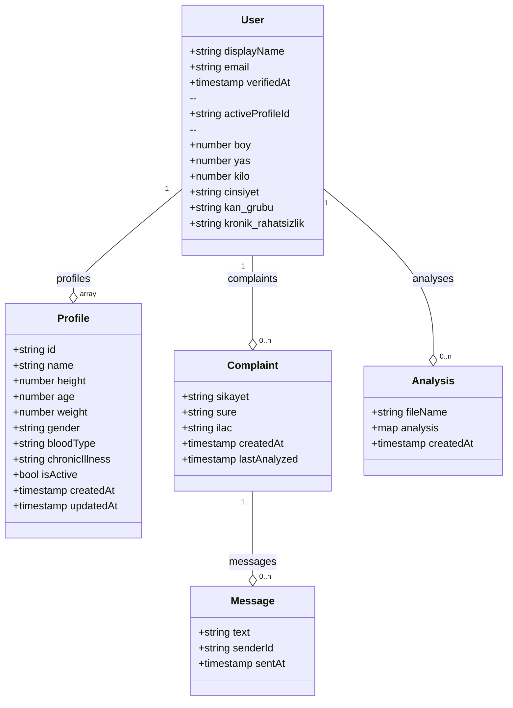
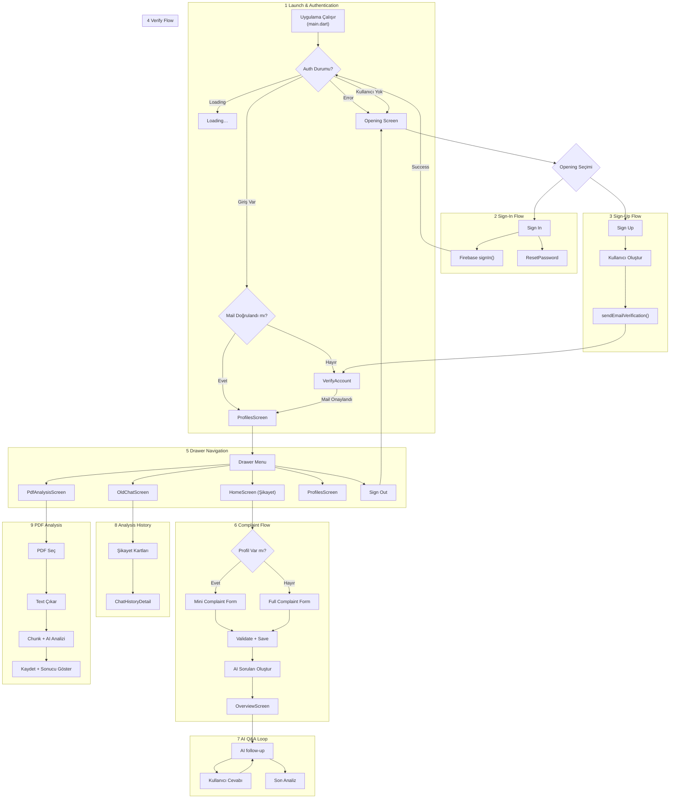

# DoktorumOnline AI

**DoktorumOnline AI** – Flutter ile geliştirilmiş, Firestore + Firebase Auth altyapısını kullanan mobil bir sağlık asistanı uygulamasıdır.

---

## 📦 Uygulama Paketi (APK)

[En son APK’yı indir](https://github.com/recepzgrmh/DoktorumOnline-AI/releases/tag/v0.0.1-beta)

---

## 📋 Uygulamanın Amacı ve Özellikleri

- **Semptom Girişi:**  
  Boy, Cinsiyet, Yaş, Kilo, Kan Grubu, Şikayet, Şikayet Süresi, Mevcut İlaçlar ve Kronik Rahatsızlıklar adım adım girerek hızlıca sağlık verilerinizi paylaşırsınız.  
  _Burada kullanıcıdan boy, yaş, kilo ve şikayet kısımlarını zorunlu olarak doldurması isteniliyor._
- **Yapay Zeka Sohbeti:**  
  AI yönlendirmeli sorularla (adım adım form doldurma yerine doğal sohbet akışı) semptomlarınızı derinlemesine toplar. Hastalığınız (Şikayetiniz) ile ilgili detaylı sorular sorar.
- **Anında Analiz:**  
  Girdiğiniz bilgiler doğrultusunda yapay zeka tarafından oluşturulmuş kişiye özel sağlık önerilerini ve detaylı analiz raporunu görürsünüz.
- **Geçmiş Şikayetler:**  
  Tek bir dokunuşla önceki şikayet ve analiz geçmişinize ulaşarak önceki değerlendirmeleri tekrar inceleyebilirsiniz.

---

## 🏗️ Teknoloji ve Mimarisi

1. **Flutter**  
   Tüm ekranları tek bir kod tabanında, hem iOS hem Android için responsive olarak yazdım.
2. **Firebase Authentication**  
   E-posta / şifre ve Google oturum açma destekli kimlik doğrulama; kullanıcı verilerini güvenle saklıyor.
3. **Cloud Firestore**
   - Kullanıcı profili ve şikayet kayıtları, NoSQL doküman yapısında tutuluyor.
   - `StreamBuilder` widget’ı ile “canlı” veri akışı sağlanıyor: yeni kayıt eklenir eklenmez UI güncelleniyor.
   - Yapay zeka sohbet ekranında da mesaj atılır atılmaz hem UI hem de Firestore veritabanı eş zamanlı güncelleniyor.

---

## 🗂️ Firestore Veri Modeli (Güncel)

---

## 🔁 Uygulama Akış Diyagramı

---

## 🎓 Öğrenme Süreci ve Karşılaşılan Zorluklar

- **Asenkron Veri Akışı:**  
  Firestore’dan `snapshots` alıp widget’lara aktarmakta zorlandım; StackOverflow ve resmi dokümantasyon örnekleriyle `StreamBuilder` widget’ını kullanmayı biraz öğrendim.
- **Firestore Veritabanı Düzenlemeleri:**  
  AI sohbet mesajlarını eski şikayetler kısmında göstermek için veritabanı yapısını baştan düzenledim.
- **Yapay Zeka Entegrasyonu:**  
  Chat akışındaki doğal dil sorularını dinamik olarak hazırlamak için OpenAI API’si kullandım; örnek prompt’ları ChatGPT’den oluşturarak hızla test ettim.
- **Yeni Paket Kullanımı:**  
  Dash Chat 2 paketini entegre ederek sohbet ekranı geliştirmesini hızlandırdım; “Amerika’yı yeniden keşfetmeme gerek kalmadı” 😊

---

## 📚 Yardım Alınan Kaynaklar

- **StackOverflow:** Firestore query sorunları, `StreamBuilder` pattern’leri, widget prop kullanımları
- **YouTube:** Firebase Auth, Firestore veri ekleme, `StreamBuilder` ve Dash Chat 2 kılavuzları
- **Yapay Zeka Araçları:** ChatGPT prompt optimizasyonu, örnek diyalog akışları, UI tasarım desteği
- **Resmi Dokümantasyon:** Flutter & Firebase eklentileri, Firebase Console ayarları, OpenAI servisleri

---

## 🎯 Sonuç

Bu proje ile birlikte Flutter’da daha fazla deneyim kazandım ve ilk kez kullandığım widget’lar hakkında bilgi sahibi oldum. Kullanıcı ve Yapay Zeka arasında gerçek zamanlı etkileşimi nasıl kuracağımı öğrendim. Ayrıca Firebase, Firestore ve OpenAI API’si ile çalışarak bu teknolojileri gelecek projelerde nasıl kullanacağımı pekiştirmiş oldum.
